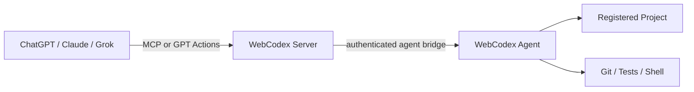
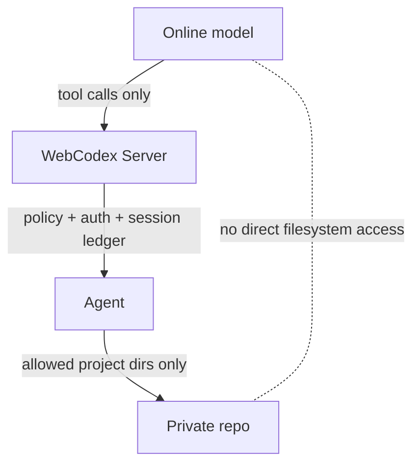
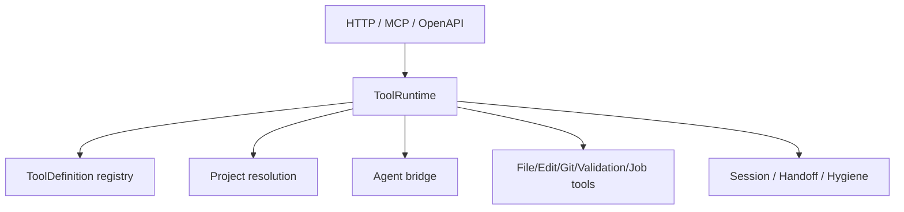
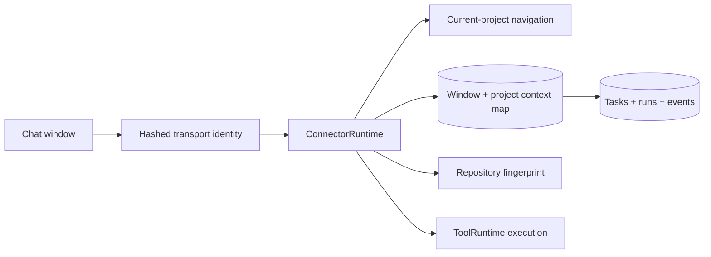
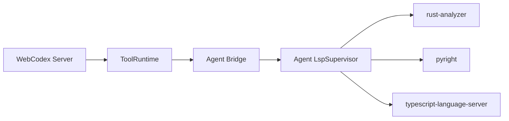

# Architecture

WebCodex is a self-hosted tool runtime that lets online AI clients operate private code through a server and a local execution agent. This document starts with the product architecture, then maps that architecture to the main Rust modules.

For vocabulary, read [CONCEPTS.md](CONCEPTS.md). For setup, read [QUICK_START.md](QUICK_START.md).

## 1. Client / Server / Agent / Codebase



The online client calls WebCodex over MCP or GPT Actions. The server authenticates the caller and dispatches runtime tool calls. The agent owns the local project boundary and performs approved file, Git, validation, shell, and job work.

## Workspace Crates and Build Reuse

The three binaries share project code through real library crates rather than
cross-package `#[path]` inclusions. The current direct dependency shape is:

```text
webcodex
  -> webcodex-admin
  -> webcodex-agent-config
  -> webcodex-core
  -> webcodex-sandbox
  -> webcodex-workspace

webcodex-cli
  -> webcodex-admin
  -> webcodex-agent-config
  -> webcodex-core

webcodex-runner
  -> webcodex-agent-config
  -> webcodex-core
  -> webcodex-sandbox
  -> webcodex-workspace
```

For the same target, profile, and feature combination, Cargo compiles a shared
crate once and reuses that artifact for dependents. A runner-only implementation
change therefore normally rebuilds the runner package and the affected shared
crates, while the server, CLI, and runner binaries are still compiled and linked
separately. Different profiles, targets, feature sets, or third-party dependency
versions can still produce multiple artifacts; this structure does not imply
that every dependency in the workspace is always compiled only once.

The workspace boundary check guarantees that cross-parent, cross-package
`#[path]` source sharing is absent. Same-crate `#[path]` uses for tests or module
organization remain allowed.

## 2. Security Boundary



The model sees tool results, not arbitrary local files. Projects are registered by agents. The server does not scan the filesystem. Shell and job tools are bounded but powerful, so deployments should keep agent roots narrow and credentials scoped.

## 3. Runtime Module Map



The protocol adapters translate incoming requests into runtime tool calls. The ToolRuntime applies shared dispatch, project resolution, session recording, and domain tool behavior before routing agent-backed work to the agent bridge.

## Runtime Surfaces

- `runtime_http` exposes REST runtime routes, including generic runtime tool calls and dedicated project/file wrappers.
- `mcp` exposes exactly one startup-selected model surface. Complete
  `WEBCODEX_CONNECTOR_SURFACE=task-v1` configuration selects the twelve-tool
  Canonical Connector. An absent surface variable explicitly selects the full
  operator registry and emits a startup warning; invalid or incomplete
  Connector configuration fails startup. MCP discovery/initialize and runtime
  status report the active surface.
- `openapi` builds the GPT Actions schema for the focused public operation surface.
- `connector_runtime` owns the canonical project-bound coding path. It maps one
  transport window and exact repository identity to an existing durable
  Connector Task before invoking the ToolRuntime execution primitives.
- `tool_runtime` owns protocol-independent tool parsing, dispatch, project resolution, registry metadata, sessions, handoff, hygiene, files, Git, patches, Cargo validation, shell, jobs, artifacts, and checkpoints.

## Project-Bound Continuity



`task_start` is the single start-or-continue entry point. Under a per-window
lock it resolves context without duplication by comparing the authenticated
subject, Connector project id, and hash of the canonical repository path. An
active mapped task is reused and every accepted new instruction becomes an
ordered `task_instruction` event; a terminal task causes a new task without
deleting history. The process-local current-project map reports navigation
only. Durable task history and the per-repository window map live in SQLite, so
switching projects neither closes nor deletes the previous task.

The preceding paragraph describes the Canonical Connector surface. On the full
operator runtime, `start_coding_task` provides the same ordinary user semantics
without creating Connector Tasks: its internal current key contains principal,
transport, stable window, resolved project, and a domain-separated hash of the
canonical repository root. The default ensures or continues one active
Workflow Session and appends a bounded `task_instruction` ledger event.
`resume_session_id` instead selects exactly one known active Workflow Session;
it wins over any current binding, never falls back or creates on failure, and
is mutually exclusive with `new_session=true`. Without an explicit resume,
`new_session=true` alone requests an isolated Session; a changed title never
does. Project switches retain independent keys, and a mode transition updates
guards and appends the capability-change event under one Session-store lock.
The exact current binding has a process-local cache and a bounded durable
projection in the Workflow Session JSON ledger, so restart recovery does not
depend on an explicit model-supplied Session id.
Project-scoped Workflow Sessions may additionally persist a strongly typed
`default_cwd` (project-relative) and `default_shell` (`sh`/`bash`). Creation,
continuation replacement, explicit context update, instruction append,
capability transition, and binding changes share the Session-store atomic
commit boundary. `run_shell`/`run_job` inherit only from an exact active
project match, after per-call arguments and before the existing root/profile
defaults; cross-project escape never inherits this state.
The full runtime also keeps `PersistentShell` distinct from `Job`.
`open_session_shell` explicitly starts one process-local, command-oriented
`sh`/`bash` per active Workflow Session; `session_shell_exec` serializes
commands against that process, while status and idempotent close use its
unpredictable Session/project-bound id. Agent projects execute it on their
owning Runner. A Server-owned executor branch is retained for hosting surfaces
that supply a Server-local project, while the built-in public registry currently
advertises Agent projects only. One-shot `run_shell`/`run_job` never share its
process state.
Dedicated control framing separates completion from bounded stdout/stderr;
timeout synchronization failure poisons and kills the shell. Shell records do
not imply restart recovery, and SSH resources, PTYs, or terminal streams are
not part of this model.
The Connector Task ledger and Workflow Session ledger remain separate internal
models; neither is copied into the other.

Window identity is transport-owned and never accepted as a normal tool field.
MCP initialize mints `Mcp-Session-Id`, which a conforming client echoes on later
requests. Hosted Actions use their conversation-scoped request header when
present. Other HTTP clients use a server-generated `HttpOnly`, `SameSite=Lax`
cookie and must keep separate cookie jars for separate logical windows.
WebCodex stores only domain-separated SHA-256 identities. The full-runtime
durable current binding hashes the complete canonical tuple—principal kind/id,
transport, already-hashed window identity, resolved project, and already-hashed
canonical repository root—under a second domain separator with length-prefixed
components. Its ledger row contains only that composite digest, a `wc_sess_*`
id, and `updated_at`. Raw window ids, credentials, authorization material, and
repository paths are not persisted or returned by this mechanism. Distinct
windows using one credential therefore cannot overwrite each other. Explicit
Workflow Session recovery is the bounded exception to requiring that key: it
accepts a `wc_sess_*` id, not a window id, and does not create a binding when
stable window identity is absent.

The continuity fingerprint contains hashes and identities, not repository file
contents: canonical root, branch, HEAD, porcelain worktree state, applicable
root/nested instruction files, target directory, and supported manifests.
Capture is strictly bounded: at most 512 untracked files, 256 KiB per
untracked file, 4 MiB total untracked bytes, 2 MiB of tracked diff output, 128
manifest candidates, 100,000 fallback scan entries, and three seconds of scan
time. Context files are content-hashed up to 512 KiB. Large regular files use
metadata plus a bounded prefix/suffix digest; untracked symlinks hash only the
link target and are never followed. Manifest discovery uses manifest-specific
Git pathspecs instead of enumerating every repository file. A clean porcelain
status skips tracked diff and untracked content work entirely.

Exhausting any budget marks the affected slice partial and emits only compact
warning codes—never content or absolute paths. Comparisons treat an unchanged
partial digest as unknown, not reused; a changed digest is still refreshed.
Rule and manifest enumeration has the same conservative removed/unknown
behavior. Repository rules are content-hashed so complete unchanged rules need
not be reintroduced into the model context.

Connector creation/continuation, its instruction event, capability transition,
and durable window binding share one SQLite transaction. If a previously
prepared writable worktree cannot be committed to that transaction, the
managed lease and registration are released so a retry cannot create a hidden
active context. The full runtime commits Session creation/update, instruction
event, process-local cache replacement, and durable exact binding replacement
under one Session-store lock. Explicit resume validates id, active lifecycle,
exact resolved project, caller access, and safe mode/guard changes before that
commit; enabling writes rechecks `project:write`. The instruction event records
the requested capability/context refresh, explicit resume, and binding result.
They enter the same background-writer generation and JSON ledger snapshot;
`flush_persistence` therefore observes the Session, event, and binding together
under the ledger's existing atomic-rename semantics. A failed pre-commit check
leaves all of them unchanged, so retry adds one instruction. This does not add
a stronger fsync or distributed-consistency guarantee.

After a server restart, SQLite task/event history and exact window/project
mappings remain. Process-local “currently viewed project” state is deliberately
discarded. A client that retains its MCP session header, hosted conversation
header, or HTTP cookie restores the matching repository on its next
`task_start`; a lost transport identity is never guessed from user, credential,
project name, or path. MCP refuses an anonymous `task_start`, while generic
HTTP clients that discard cookies cannot receive automatic cross-request
continuity and must use explicit durable-task recovery. `task_resume` moves the
lightweight task binding to the new stable window; it does not copy the task or
let both windows inherit one active context. Existing running Connector
executions continue to follow the pre-existing fail-safe restart rule and
become interrupted rather than being silently resumed.

Independently, the full runtime reloads its Workflow Session ledger and bounded
durable exact bindings. On the next `start_coding_task`, the same principal,
transport, stable window, resolved project, and canonical repository root may
continue only a known active Session whose stored project matches, then
repopulate the process-local cache and append the new instruction. Missing
stable identity never falls back to a credential-wide key. Changed roots,
closed or evicted Sessions, malformed/duplicate/excess binding rows, and
project mismatches do not restore; stale rows are discarded without preventing
valid Workflow Sessions, events, or messages from loading. `new_session=true`
repoints the exact binding without closing or deleting prior history. This JSON
binding remains separate from the Connector's SQLite Task mapping and does not
itself recover running jobs or executions. Agent-backed shell jobs use the
separate same-runner reconciliation layer described below.

If the client knows an existing `wc_sess_*` but cannot retain stable window
identity, `start_coding_task(resume_session_id=...)` can continue that active
Session after exact project, lifecycle, access, and capability validation. It
preserves the Session id and root title and appends the new instruction. No
process-local, durable, fabricated-window, or credential-wide binding is
created, so later project tools must keep passing `session_id`. With a stable
window and `bind_current=true`, the explicit Session atomically replaces the
exact current binding without closing the previously bound Session; setting
`bind_current=false` leaves both layers untouched. Connector Tasks and Action
Audit Sessions are never sources for this Workflow Session lookup.

## Agent Bridge

- `shell_client` is the server-side agent registry and transport bridge. It tracks connected agents, project registrations, request/response flow, job updates, and agent policy summaries.
- `crates/webcodex-runner/src/webcodex_runner/*` owns the runner binary behavior: config loading, transport fallback, project registry parsing, file/patch/artifact/checkpoint handling, shell execution, and response shaping.
- `crates/webcodex-runner/src/webcodex_runner/lsp/*` owns the LSP process supervisor and read-only navigation handlers. Supported languages live in one registry (`lsp/language.rs`): each `LanguageProfile` pairs a server with its extensions/`languageId`s, project markers, executable resolution, and constrained read-only `initialize` profile, so the supervisor and handlers carry no per-language branches. Rust (`rust-analyzer`), Python (`pyright`), and TypeScript/JavaScript (`typescript-language-server`) ship today. Results use project-relative paths, 1-based Unicode scalar columns, bounded truncation, and omit external (registry/sysroot/stdlib) locations.
- `tool_runtime::semantic_navigation` builds the always-present compact `start_coding_task.semantic_navigation` capability summary. It sends only typed `AgentLspRequest::Status` under one two-second deadline and parses the versioned result contract directly, without recursively dispatching the public `lsp_status` ToolCall or recording a nested session event. Agent status resolution may inspect Cargo workspace presence, executable availability, and an existing supervisor slot, but it never starts a language server, runs Cargo or shell commands, or retrieves symbol/location data. This startup summary is currently Rust-focused (a Rust readiness hint); the seven runtime tools themselves are multi-language. The summary is read-only, workspace-only, dependency-limited by `cargo.noDeps=true`, and marked `full_text_sync_only`: validated workspace `.rs` files refresh open LSP documents from current disk content, without editor-style incremental synchronization. Probe failure or unavailability remains non-blocking acceleration metadata and is projected as the actionable `semantic_navigation_unavailable` warning in the model-facing startup brief.

The agent is where private repository paths are interpreted. The server routes by runtime project id, such as `agent:<client_id>:<project_id>`.

### Same-Runner Job Continuity

Agent-backed async jobs have a bounded, process-local continuity layer
independent of Workflow Session persistence and Connector execution state.
When a job is accepted, the server sends the already-authorized project,
Workflow Session, cwd, purpose, shell, safe command preview, and validation
plan to the runner. The runner stores those fields with lifecycle/result state,
monotonic `update_seq`, bounded log tails and absolute line ranges, validation
progress, and live child/process-group control handles.

Every executor transition updates that runner record under the JobManager lock
before best-effort network delivery. Active records are never evicted. Terminal
records release process-control resources but remain in memory for 15 minutes,
up to 64 records. Each stream is capped at 64 KiB; the complete registration
inventory is capped at 1 MiB and always prioritizes at most 64 active records.
Raw command, stdin, environment, credentials, and complete Agent configuration
are absent from the inventory.

On a capable-runner disconnect, the server changes accepted active jobs to
nonterminal `recovering` instead of immediately claiming the result was lost.
The same running `agent_instance_id` has a bounded grace window (default 120
seconds; overridable with `WEBCODEX_JOB_RECOVERY_GRACE_SECS`, clamped to
5–3600 seconds) to re-register with its complete active inventory. Registration
validates the whole inventory before mutation and, under one registry mutex,
resolves the instance lease, replacement loss, missing-active loss, and
snapshot merge. Snapshot tails replace server tails; incremental and replay
updates share the same monotonic sequence rule. Network I/O is never performed
while the Registry or JobManager record lock is held. Long-lived transports
also receive an internal per-connection lease, so cleanup from an older
same-instance socket cannot disconnect the socket that just completed
reconciliation.

`recovering` is bounded even without request traffic: an in-process sweep
transitions a job whose grace window has elapsed to terminal `lost`
(`runner_recovery_deadline_exceeded`) with a per-pass cap and no disk/network
work under the registry lock. The deadline is anchored to when the job entered
`recovering` and is not extended by stale-connection keepalive, repeated
disconnect, or late inventory. The Job Registry is server in-memory state, so
the deadline is a per-Server-process property and is not persisted across a
server restart; after a restart, recovery depends on the runner reconnecting
and submitting its inventory (a fresh recovery window begins), and a durable
server-side Job ledger remains a separate future phase.

A fresh server can therefore rebuild the original `job_id`, ownership, status,
bounded logs, and stop routing without re-executing the command. A recovered
active job continues through `job_status`, `job_log`/`job_tail`, and
`stop_job`; a job completed while the server was unavailable is restored from
the retained terminal snapshot. A replacement `agent_instance_id` does not
inherit the old instance's jobs (they are `lost` with `runner_instance_replaced`),
and a delayed disconnect from a replaced instance is a no-op against the
current instance. Older runners that do not advertise `job_state_reconciliation`
keep the immediate-`lost` disconnect behavior (`legacy_runner_disconnected`)
and never enter `recovering`. A malformed structured validation progress
update is an executor protocol violation that moves the job to terminal `failed`
with a bounded `validation_progress_invalid`-class error, retaining the last
valid progress and never re-executing. Runner restart is deliberately outside
this phase because the new process cannot recover old child handles. This
layer does not merge Connector Execution with Full Runtime Job, provide
generalized exactly-once command execution, cross-runner or cross-machine job
migration, or make a `run_job` invocation idempotent.

### Agent-Side LSP Architecture



The LSP process runs only on the agent, at the canonical root of a registered project. The supervisor selects the language server from the target file's extension via the registry and keys running processes by `(project root, server kind)`. The server never reads agent project files directly and does not spawn a shell to run LSP work. Typed bridge requests preserve the project boundary and do not permit arbitrary LSP-method or JSON-RPC parameter passthrough. Each language ships a constrained read-only `initialize` profile that must not execute repository code or fetch dependencies: for Rust, `cargo.noDeps=true` with build scripts, proc macros, and `checkOnSave` disabled; for Python, pyright never executes project code; for TypeScript, `disableAutomaticTypingAcquisition=true` blocks npm `@types` downloads. The agent does not install servers, download dependencies, execute project build scripts, or run native validation.

Public read-only intelligence tools (`lsp_status`, `document_symbols`, `goto_definition`, `find_references`, `document_diagnostics`, `hover`, and `workspace_symbols`) follow the path shown above for any supported language. Validated workspace source files are read from current disk content; the first preparation sends `didOpen` version 1 (with the extension's `languageId`), changed content sends a monotonic full-text `didChange`, identical content sends nothing, and a restarted server instance opens again at version 1. This is disk-backed full-text refresh, not editor-style incremental synchronization. Diagnostics availability is optional feedback and does not lower `start_coding_task`'s startup verdict.

Diagnostics use the server's `textDocument/publishDiagnostics` path because this supervisor profile has a reliable notification flow and does not assume pull-diagnostic support. Each server instance keeps only the latest publication for at most 256 URIs and at most 500 raw diagnostics per URI. A Condvar wait shares one two-second deadline. `fresh=true` means the cache version matches the prepared document or a matching publication arrived after preparation; `timed_out=true` returns the latest stale cache (or an empty result) as a normal tool success. Restarting the server clears the cache. This is quick semantic feedback under the constrained profile, not native build/validation.

Hover content is normalized to bounded markdown/plaintext without interpreting it. Workspace symbols are sorted, deduplicated, limited on the agent, filtered to canonical project source files owned by the queried language, and returned with project-relative paths only. Registry, sysroot, dependency, absolute-path, file-URI, executable-path, environment, and raw process-output material never belongs in public results. Public positions remain 1-based Unicode scalar coordinates while the agent converts the negotiated UTF-8, UTF-16, or UTF-32 encoding internally.

## Validation Intelligence

Validation evidence follows one shared path rather than a parallel verdict model:

```text
bounded validation-tool result metadata
        -> session ledger
        -> structured_validation_parser v3
        -> validation_events aggregation
        -> finish_coding_task / session_handoff_summary / validation_summary
```

The parser is deterministic and fail-closed. It consumes only the bounded, sanitized metadata captured for the existing validation-tool allowlist; ordinary `run_shell` output is not validation evidence. It returns at most 20 cargo diagnostics and 20 failed-test details, uses project-relative safe locations, truncates diagnostic messages at 240 Unicode scalars, and never stores or returns full stdout/stderr, commands, environment variables, panic bodies, assertion values, or backtraces. It classifies event evidence conservatively as `compile_error`, `test_failure`, `timeout`, `process_exit`, `format_diff`, or `unknown`; this evidence never changes whether the underlying validation call succeeded.

`validation_events` continues to own `status`, `latest_status`, and `historical_failures`. A failed-then-passed sequence therefore remains `status=mixed`, reports `latest_status=passed`, and keeps the resolved failure for audit without lowering the final task outcome. A successful zero-test `cargo_test` cannot resolve an earlier cargo-test failure. Parser unavailability or truncation changes only evidence completeness, never verdict semantics.

`validation_summary` is a project-read, explicit-session query over this same aggregation. It does not execute Cargo or shell, enqueue an agent request, read project files, mutate the workspace, or record itself as validation evidence. It is useful for a fresh MCP window or review, but it does not replace `finish_coding_task`, which also evaluates workspace, jobs, hygiene, failure expectations, evidence integrity, and the canonical final task/evidence outcomes.

`start_coding_task`, `finish_coding_task`, and `session_handoff_summary` (and `validation_summary`, for its `validation_delta` part) surface a deterministic `continuation_feedback` projection of the previous attempt over existing ledger/evidence/Job/message-board state. It is read-only — no shell, file reads, agent/runner requests, ledger mutation, activity refresh, guidance consumption, or LLM call — and adds no new persistent table or second attempt state machine. Validation delta is comparable only when both runs are proven to cover the same structured scope with complete evidence and a consistent parser identity; otherwise it reports a stable reason code. Its `scope_identity` is an opaque, domain-separated SHA-256 that never re-exposes command text or absolute paths, and when the attempt boundary has been evicted by the bounded event window it reports `complete = false` rather than claiming a full attempt.

`finish_coding_task` and `session_handoff_summary` additionally call one shared
pure `handoff_brief` builder over snapshots already obtained by their enclosing
call. This strict versioned projection is the at-most-8-KiB task/workspace/
progress/validation/attention view for a new window, new Agent, or human
receiver; the more detailed evidence remains in `continuation_feedback`. The
builder performs no I/O or execution, mutates no Session or guidance, adds no
persistent representation, and is intentionally absent from
`start_coding_task` so startup's bounded core does not grow. It is neither
Session replay nor recovery of hidden model context.
Calling the internal projection path directly adds no business event. MCP,
REST, and runtime dispatch still wrap `session_handoff_summary` in the uniform
recorder and append the normal `tool_call_started` / `tool_call_finished`
telemetry; that recorder activity may change Session counters/timestamps and is
not a side effect of the builder. The tool has no recorder bypass.

## Auth, Policy, And Audit

- `auth` owns bearer authentication, principal modeling, scope constants, route gates, shared-key helpers, PAT verification, and OAuth token verification.
- `oauth_http` owns OAuth HTTP endpoints, consent, token exchange, revocation, metadata, and shared-key bridge UI.
- `db` owns persistence for users, tokens, agents, audit entries, OAuth rows, and schema migrations.
- Session and audit evidence is bounded and redacted. It is designed for task review and handoff, not for storing raw secrets, command bodies, or complete file contents.

## CLI And Operations

- `crates/webcodex-cli/src/webcodex_cli/*` owns setup and operations commands such as server bootstrap, connect, pairing, token creation, doctor checks, service installation, and profile handling.
- Deployment docs should use the CLI for management tasks rather than exposing management endpoints to GPT Actions or MCP.

## Frontend

The current product entry points are MCP, GPT Actions, REST, and CLI. Any frontend should remain an operator aid and should not become the model-facing trust boundary unless it uses the same runtime, auth, and session rules.

## Invariants For New Runtime Tools

When adding or renaming a runtime tool, keep these synchronized in the same change:

- `ToolCall` parsing and known tool names.
- Tool metadata and registry schema.
- OAuth scope policy.
- MCP `tools/list`.
- GPT Actions accepted names, examples, and flattened fields when applicable.
- Consistency tests.

Default to exposing new specialized behavior through the generic runtime tool path unless there is a clear product reason and GPT Actions operation-count budget for a dedicated operation.

### ToolDefinition Dead-Code Hygiene

`src/tool_runtime/tool_definition.rs` must not use a module-wide `#![allow(dead_code)]`.
During the ToolDefinition migration, unused residue should be removed when
possible. Test-only helpers should be placed behind `#[cfg(test)]`, and any
remaining temporary compatibility allowance must be item-scoped rather than
module-wide.

Schema migration tests enforce this documentation so the tool surface does not
quietly accumulate broad dead-code allowances while ToolDefinition, ToolCall,
MCP, OpenAPI, and metadata stay synchronized.
